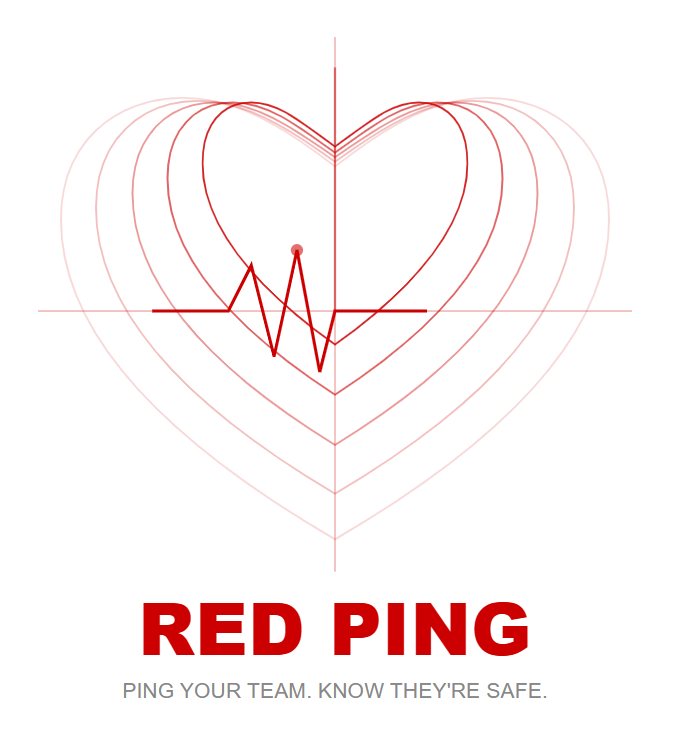

# RED Ping | Mission Locator

  

## What is RED Ping?

RED Ping is a simple mission-mode location tool built for
humanitarian volunteers. Not born from frustration — born from care.

It helps team members locate each other during active missions
quickly, safely and without complication.

No tracking outside missions. No data kept after.
Just your team, your map, your mission.

## How it works

- Volunteer activates Mission Mode before deployment
- Location shared only with verified team members
- Team leader sees all active members on a simple map
- One tap to ping a teammate: "I'm here"
- Mission ends: sharing stops automatically
- No location data stored after mission close

## Features (v0.1)

- Mission Mode: location sharing on/off by volunteer choice
- Team map view: see all active members in real time
- Quick ping: one tap check-in signal
- Auto-stop: sharing ends when mission closes
- Offline map caching for low-signal areas
- No account needed beyond team registration

## Future features

- Bluetooth mesh for low or no signal situations
- Emergency alert button
- Mission log for team coordination
- Multi-language support for international deployment

## Principles

- Active by choice. Silent by default.
- Safety first. Privacy always.
- Built for emergencies. Never monetised because of them.
- Ethical by design. Private by default.
- Free forever. No exceptions.

## Current stage

- concept definition
- initial documentation
- Python prototype in progress

## Next steps

- build basic location sharing logic
- build mission mode on/off toggle
- build simple team map view
- explore lightweight offline capability

## Vision

Every volunteer knows where their team is.
Every mission ends with everyone accounted for.

## Philosophy

Humanitarian work asks a lot of the people who show up.
The tools they use should never be one of the burdens.

RED Ping is built on one belief: technology in service of people
should stay simple, stay private and stay free.

Not because it has to.
Because it should.

## Free forever

Emergency response should never come with a subscription.
RED Ping will always be free for humanitarian and volunteer use.
No premium tier. No data sold. No exceptions.

This is non-negotiable.

## Personal note

RED Ping wasn't born from frustration like my other projects.
It was born from care.

Becoming a Croix-Rouge française volunteer made me think about
the people I would work alongside. The ones going out at night.
The ones splitting up across unfamiliar streets to reach
people who need help.

I wanted to build something that helps keep them safe in
my own small way.

Because that's what this is all about.
Not profit. Not recognition.
Just showing up for the people who show up for others.

*RED Ping. Ping your team. Know they're safe.*
